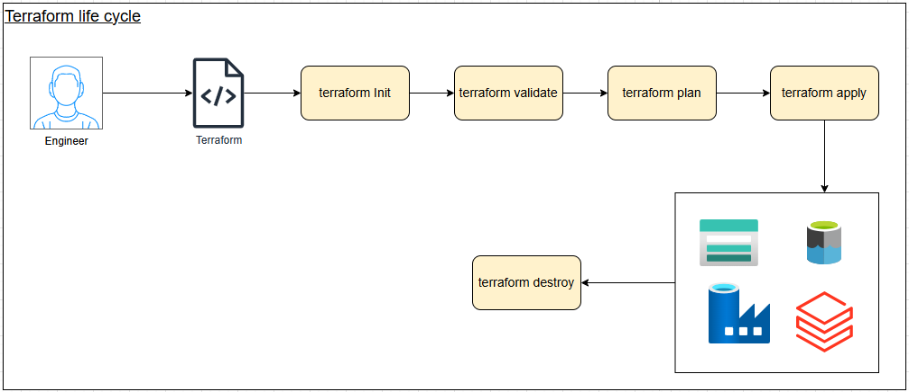
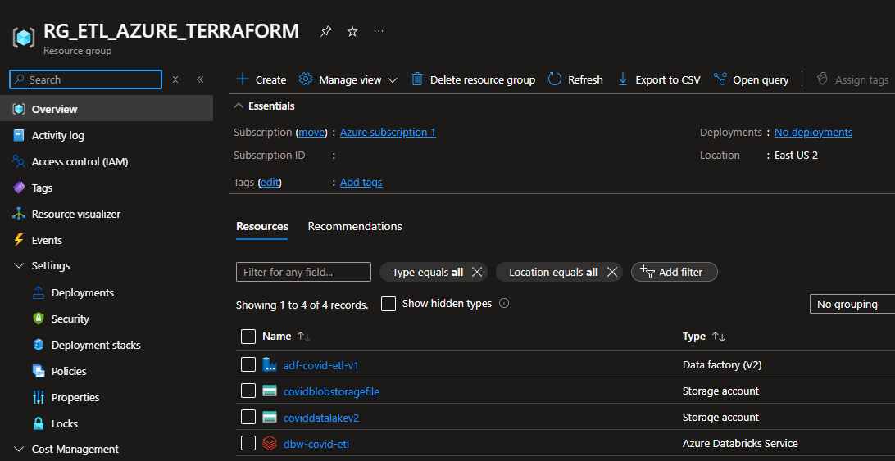
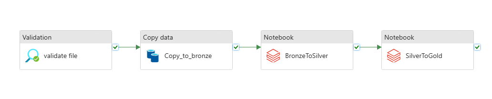

# Crear recursos Azure para ETL mediante terraform

<br>

## Prerequisitos : 
- Descargar y configurar el ejecutable de terraform : https://developer.hashicorp.com/terraform/install
- Instalar cliente azure : https://learn.microsoft.com/es-es/cli/azure/install-azure-cli

## Descargar el proyecto :
```shell
git clone https://github.com/jeanavellaneda/createResourceWithAzureTerraform.git
```

## Auntenticación :
### Abrir una terminal y ejecutar
- az login
- az account set --subscription "SUBSCRIPTION-ID"
- az ad sp create-for-rbac --role="Contributor" --scopes="/subscriptions/"SUBSCRIPTION-ID"

#### Si todo esta bien nos mostrará algo similar a : 
```shell
{
  "appId": "<SERVICE_PRINCIPAL_APPID>",
  "displayName": "<DISPLAY_NAME>",
  "password": "<SERVICE_PRINCIPAL_PASSWORD>",
  "tenant": "<TENANT_ID>"
}
```

## Ejecuar terraform
---
- **terraform init :** Inicializa un directorio de trabajo de Terraform
- **terraform validate :** Valida la configuración de Terraform
- **terraform plan :** Genera un plan de ejecución
- **terraform apply :** Aplica los cambios definidos en la configuración de Terraform
- **terrform destroy :** Elimina todos los recursos gestionados por Terraform en la configuración actual

<br>
<br>